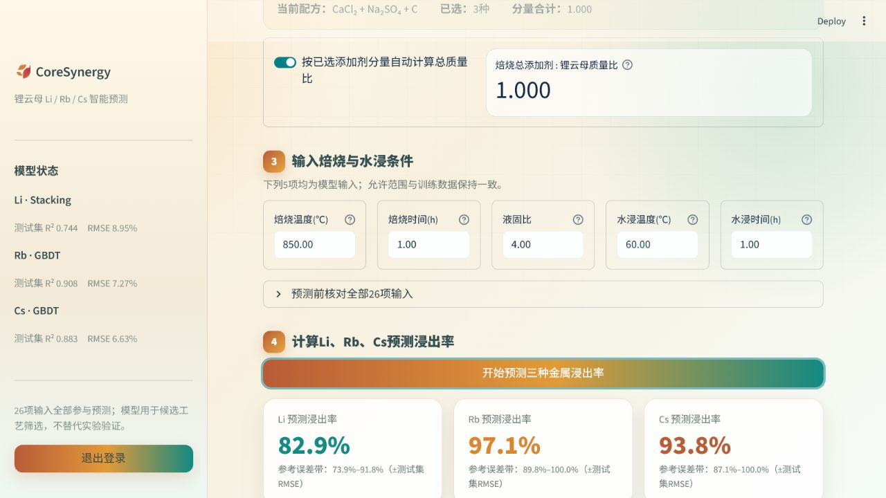

# 锂云母 Li/Rb/Cs 智能浸出预测平台

这是一个基于 Streamlit 的预测应用。用户输入品位编码、焙烧剂总量与各添加剂分量、焙烧条件和水浸条件后，应用输出 Li、Rb、Cs 的预测浸出率。

新版采用明亮的秋日科技风界面，完整展示模型使用的26项影响因素：

- 品位类别编码和焙烧总添加剂/锂云母质量比；
- 数据集中的19种焙烧添加剂，可逐一勾选并填写各自与锂云母的质量比；
- 焙烧温度、焙烧时间、液固比、水浸温度和水浸时间。

19种添加剂为：H₂SO₄、HCl、K₂S₂O₇、KHSO₄、FeSO₄·7H₂O、KOH、CaO、NaCl、CaCl₂、SLS（木质素磺酸钠）、NaOH、Ca(OH)₂、(NH₄)₂SO₄、Na₂SO₄、CaSO₄、CaCO₃、K₂SO₄、NaHSO₄和C。



## 本地运行

1. 安装 Python 3.11 或 3.12。
2. 在本目录执行 `pip install -r requirements.txt`。
3. 复制 `.streamlit/secrets.toml.example` 为 `.streamlit/secrets.toml`，填写登录账号与密码。
4. 执行 `streamlit run app.py`。

本地交付包已配置用户指定的账号 `admin` 和密码；`.gitignore` 会阻止真实密钥被提交到 GitHub。

## 第一步：上传到 GitHub

GitHub 负责保存代码，Python 网页仍需部署到 Streamlit Community Cloud、Render 等运行平台。不要提交 `.streamlit/secrets.toml`。

```bash
git init
git add .
git commit -m "Initial lepidolite predictor"
git branch -M main
gh auth login
gh repo create lepidolite-leaching-predictor --public --source=. --remote=origin --push
```

如果不使用 GitHub CLI，也可以在 GitHub 网页中新建仓库，再上传“GitHub安全版”压缩包解压后的文件。

## 方案A：Streamlit Community Cloud（最快）

1. 在 GitHub 新建仓库并上传本目录；确认 `.streamlit/secrets.toml` 没有出现在提交中。
2. 打开 Streamlit Community Cloud，选择 **Create app**，连接仓库、分支和 `app.py`。
3. 在应用 **Settings → Secrets** 中加入：

   ```toml
   [auth]
   username = "admin"
   password = "你的实际密码"
   ```

4. 部署完成后获得 `*.streamlit.app` 地址。
5. Streamlit Community Cloud 的“自定义子域名”仍属于 `*.streamlit.app`，不能直接把地址栏固定为 `https://www.coresynergy.com`。可以在域名服务商设置网页转发，但跳转后地址会变为 Streamlit 地址。

## 方案B：Render + `https://www.coresynergy.com`（推荐）

仓库已包含 `render.yaml`。在 Render 中选择 **New → Blueprint** 并连接 GitHub 仓库，设置环境变量：

```text
APP_USERNAME=admin
APP_PASSWORD=你的实际密码
```

服务创建后，在 **Settings → Custom Domains** 添加 `www.coresynergy.com`。随后在域名DNS中为 `www` 新建 CNAME，指向 Render 分配的 `*.onrender.com` 地址，再回到 Render 验证。Render 会自动签发HTTPS证书。根域名 `coresynergy.com` 可按平台提示重定向到 `www`。

## 方法与限制

- 七模型比较：LGBM、随机森林、XGBoost、Stacking、极端随机树、GBDT、SVR。
- 采用 80/20 划分、五折交叉验证与 Optuna-TPE 贝叶斯调参。
- 最佳模型：Li 为 Stacking，Rb 与 Cs 为 GBDT。
- 模型基于文献数据，适合候选条件筛选，不替代实验验证。
